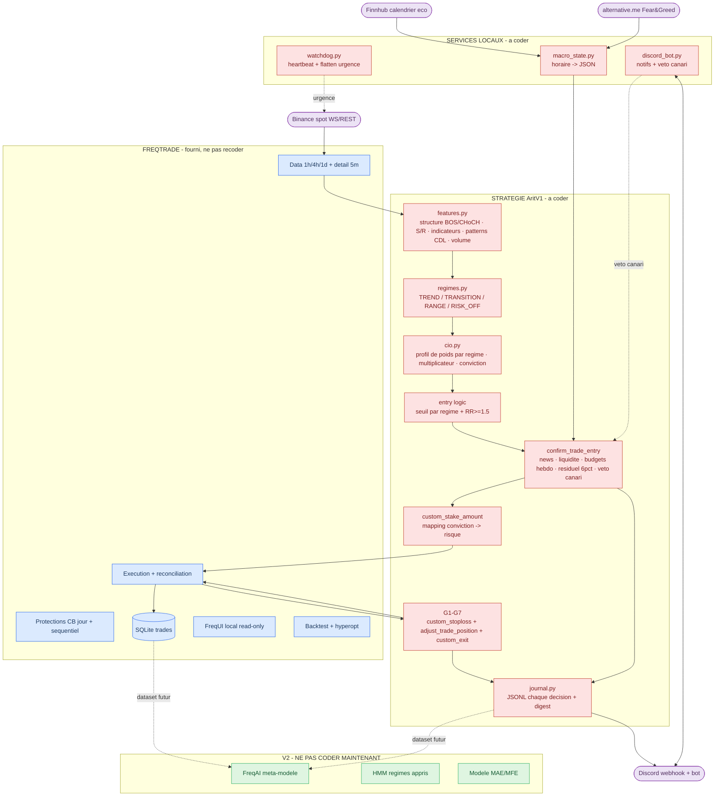

# 02 — Architecture v3 (freqtrade-first)

## Vue d'ensemble (mermaid)

Légende : **rouge** = à coder (V1) · **bleu** = fourni par freqtrade (interdiction de le recoder) · **vert** = V2, ne pas toucher · **violet** = API externe.

## Flux d'une décision (précis)
1. Clôture d'une bougie 4h → `populate_indicators` a déjà calculé toutes les features (1h base + colonnes 4h/1d mergées sans look-ahead).
2. `regimes.py` classe le contexte → régime + profil de poids + seuil + multiplicateur.
3. `cio.py` calcule les scores de modules (05), applique le profil → conviction.
4. Signal d'entrée si conviction ≥ seuil du régime ET RR dispo ≥ 1,5.
5. `confirm_trade_entry` : vetos (news, liquidité), budgets (hebdo 8 %, 10 entrées, résiduel ≤ 6 %, slots ≤ 3), véto Discord si phase canari. Chaque évaluation → ligne de journal (entrée OU skip motivé).
6. `custom_stake_amount` : conviction → risque % → taille (équité courante).
7. Position ouverte → G1-G7 à chaque clôture 1h (callbacks). Chaque action de gestion → journal.
8. Sortie → journal complet (cause, R, MAE/MFE) → SQLite + Discord.

## Layout du repo
```
arit/
├── user_data/
│   ├── strategies/
│   │   ├── AritV1.py            # la stratégie freqtrade (orchestration fine)
│   │   └── arit_lib/            # logique métier importée (testable en pytest)
│   │       ├── features.py      # 05
│   │       ├── regimes.py       # 04
│   │       ├── cio.py           # 04
│   │       ├── risk.py          # 03 (sizing, budgets, résiduel)
│   │       ├── gestion.py       # 03 (G1-G7)
│   │       └── journal.py       # 08
│   ├── config.dry.json          # 07
│   └── logs/decisions/          # JSONL par jour
├── services/
│   ├── macro_state.py           # 06
│   ├── discord_bot.py           # 08
│   └── watchdog.py              # 09
├── docs/                        # CE dossier PDR v3
└── tests/                       # pytest sur arit_lib (features, risk, regimes)
```
Règle : `AritV1.py` reste mince (callbacks freqtrade) ; toute la logique vit dans `arit_lib/` en fonctions pures testables (entrées = DataFrames/valeurs, sorties = valeurs). Pandas autorisé partout pour la manipulation de données ; règles métier explicites et lisibles par-dessus.

## Ce que freqtrade fournit (NE PAS recoder)
Données et websockets · exécution/reconciliation/fills partiels · dry-run wallet · Protections · SQLite des trades · FreqUI · backtesting/hyperopt · intégration Discord (webhook). Toute tentation de réécrire une de ces briques = STOP, demander à Jonas.
