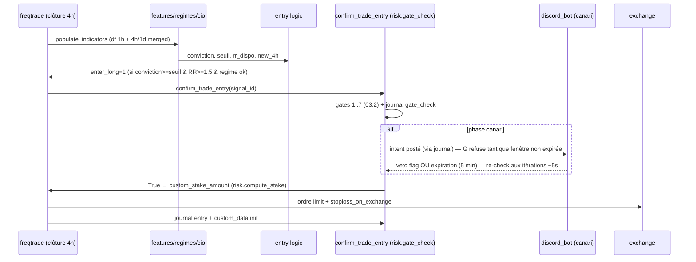

# 11 — Synchronisation & orchestration globale

> Qui tourne quand, qui lit quoi, où vit l'état. AUCUN module n'appelle un autre module directement : tout transite par la stratégie `AritV1` (callbacks freqtrade), par des colonnes de DataFrame, ou par des fichiers d'état. C'est l'héritage direct de la règle d'isolation d'ARIT v1.

## 11.1 Les cadences (toutes en UTC)
| Cadence | Quoi | Qui |
|---|---|---|
| ~5 s (itération freqtrade) | heartbeat (touch fichier) · re-check fenêtre de véto canari · sync exchange | AritV1 `bot_loop_start` / freqtrade |
| **Clôture 1h** | G1-G7 sur chaque position ouverte · update MAE/MFE · journal `gestion` | `gestion.py` via callbacks |
| **Clôture 4h** | features → régime → scores → conviction → signaux · journal `evaluation` | `features/regimes/cio` via `populate_*` |
| Horaire :00 | refresh `macro_state.json` | `services/macro_state.py` (Task Scheduler Windows) |
| Continu | tail du JSONL → posts Discord | `services/discord_bot.py` |
| 08:00 | digest quotidien Markdown → Discord | `discord_bot.py` |
| 00:00 | snapshot équité du jour (référence CB −6 %) | `AritV1 bot_loop_start` (détection de changement de date) |
| Lundi 00:00 | reset budget hebdo — **dérivé de la DB**, aucun cron (somme des trades de la semaine ISO courante) | `risk.py` à chaque gate_check |
| ~60 s | contrôle heartbeat + positions | `services/watchdog.py` (process indépendant) |

## 11.2 Détection "nouvelle bougie" (règle d'implémentation)
Base 1h + colonnes 4h mergées (`merge_informative_pair`) : la nouvelle donnée 4h apparaît sur la ligne 1h qui suit la clôture 4h. Colonne obligatoire `new_4h = (date_4h != date_4h.shift(1))`. **Un signal d'entrée n'est évaluable que si `new_4h == True`** (sinon on retraiterait le même setup 4 fois). Même principe pour les G-rules : une action par bougie 1h max (garde `last_candle_ts` en custom_data du trade).

## 11.3 Contrats de données (noms exacts, à ne pas renommer)
- **Colonnes produites par `features.py`** (consommées par regimes/cio/entrée/gestion) : `ema50_4h, ema200_4h, ema50_1d, adx_4h, rsi_4h, macd_hist_4h, atr_4h, atr_1h, vol_sma20_4h, pivot_high_conf_4h, pivot_low_conf_4h, last_ph_4h, last_hl_4h, last_hl_1h, bos_bull_4h, bos_fresh_4h, choch_bear_4h, choch_bear_1h, choch_bear_event_1h, bb_upper_1h, bb_mid_1h, bb_lower_1h, nearest_res_4h, nearest_sup_4h, res_touches_4h, rr_dispo, s_structure, s_momentum, s_sr, s_patterns, s_volume, cdl_* (~60), new_4h`. (`choch_bear_event_1h` = événement de cassure pour G6 — décision Jonas 2026-07-10, docs/03 §3.4.)
(`bb_*_1h` = Bollinger(20,2) sur 1h, câblées le 2026-08-03 — décision C3. **Calculées et
journalisées uniquement, JAMAIS décisionnelles en V1**, conformément à docs/05 §5.3. Elles
sont là pour accumuler la donnée et pouvoir être testées plus tard sur 70 915 barres.)
- **Colonnes produites par `macro_regime.py`** (posées sur le df par `attach_macro_regime`, backtest) : `macro_regime` (str), `equity_veto` (bool), `equity_veto_reason` (str). Les deux dernières viennent du bloc corrélation c6/c7 (docs/06 §6.2.1, décision A4 du 2026-08-03) — **hors de la somme des 5 composants**.
- **Colonnes produites par `regimes.py`** : `regime` (str), `seuil`, `multiplicateur`.
- **Colonnes produites par `cio.py`** : `conviction`, `signal_long` (bool).
- **custom_data par trade** (API custom_data freqtrade — persistant, dispo en backtest) : `initial_sl, risk_pct, trade_no, tp1_done, extension_on, mae_r, mfe_r, last_candle_ts, entry_conviction, entry_regime, signal_id, tp2`. (`tp2` = TP2 INITIAL, conservé à titre d'audit/journal ; depuis la décision Jonas du 2026-07-09 la sortie TP2 utilise la résistance 4h COURANTE recalculée à chaque clôture 1h — voir docs/03 §3.3 amendement.)
- **Fichiers d'état** : `user_data/macro_state.json` (06) · `user_data/state/day_equity.json` (`{"date":"YYYY-MM-DD","equity":float}`) · `user_data/veto/<signal_id>.flag` · `user_data/state/heartbeat` (mtime) · `user_data/logs/decisions/*.jsonl`.

## 11.4 Séquence d'une entrée (mermaid)

## 11.5 Règle réseau (invariant)
**Aucun appel réseau dans les callbacks freqtrade** (hors ceux de freqtrade lui-même vers l'exchange). La stratégie LIT des fichiers (`macro_state.json`, flags) ; les services (macro, discord, watchdog) font les appels externes dans leurs propres process. Garantit : latence stable, déterminisme, backtest identique au live.

## 11.6 Le véto canari est NON-BLOQUANT (décision d'implémentation importante)
`confirm_trade_entry` ne dort jamais 5 minutes (ça gèlerait la gestion des autres positions). Mécanique : au 1er passage, il journalise l'intention (`entry_intent`, avec `signal_id`) et retourne **False**. Le signal 4h reste valide (fraîcheur 3-4 bougies 1h) → freqtrade re-propose l'entrée aux itérations suivantes (~5 s) → dès que `now ≥ intent_time + veto_window` ET pas de flag véto → **True**. Entrée décalée de ≤ 5 min, gestion jamais bloquée. En dry-run `veto_window = 0`.

## 11.7 AMENDEMENT du 2026-08-04 — contrats ajoutés par le short (décision A2)

### Colonnes DataFrame (complète 11.3)
- **features** : `last_pl_4h`, `last_lh_4h`, `last_lh_1h`, `bos_bear_4h`,
  `bos_fresh_bear_4h`, `choch_bull_4h`, `choch_bull_1h`, `choch_bull_event_1h`,
  `ll_lh_intact_4h`, `rr_dispo_short`, `s_{structure,momentum,sr,patterns,volume}_short`,
  `cdl_pinbar_bear` (préfixe CDL, journalisée comme les autres).
- **regimes** : `trend_dir` (+1 / −1 / 0) et `multiplicateur_short`.
  `contracts.REGIME_COLUMNS` passe donc de 3 à 5 colonnes.
- **cio** : `conviction_short`, `signal_short`, `direction_macro`.

### `trend_dir` — pourquoi cette colonne existe
Avant A2, le prédicat TREND n'acceptait que la configuration haussière : un marché en
tendance **baissière** tombait dans le fallback RANGE, donc hors `ENTRY_REGIMES`, donc le
short était **structurellement impossible** avant même d'être codé. TREND signifie
désormais « le marché tend », dans un sens ou dans l'autre, et le SENS vit dans `trend_dir`.

⚠️ **Garde-fou de non-régression** : cet élargissement pourrait ouvrir des longs dans des
marchés baissiers qui étaient auparavant classés RANGE. Il ne le fait pas, parce que
`signal_long` exige `trend_dir >= 0` et `signal_short` exige `trend_dir <= 0`. C'est un
invariant testé (`test_trend_dir_interdit_de_trader_a_contresens_de_la_technique`) : le
casser rejouerait toute la campagne long sur un périmètre différent, sans le dire.

### `custom_data` (complète 11.3)
`is_short` (bool) — **figé à l'entrée**, source de `TradeState.sign`. Défaut `False` :
tout trade ouvert avant le 2026-08-04 est relu en long, exactement comme il a été joué.

### Direction macro (docs/01 v4)
`PORTEUR → long seul · HOSTILE → short seul · NEUTRE → les deux, seuil relevé (A5)`.
Deux fail-safes, **tous deux vers le long seul**, c.-à-d. le comportement d'avant A2 :
régime macro inconnu (NaN) et colonne macro absente. On n'ouvre jamais un short sur une
absence d'information.

⚠️ **Rupture de parité backtest/live (07.3) — bloquant déclaré du dry-run** : le régime
macro V1.1 en 5 composants n'est produit qu'en **backtest** (`macro_regime.py` sur fichiers).
En live, `macro_state.json` (06.3) porte `fear_greed` / `risk_off` / `stale` mais **pas** ce
régime. Tant que M08 ne l'écrit pas, le live reste **long-only** alors que le backtest est
long+short. Ce n'est pas un détail d'implémentation : c'est deux produits différents.
