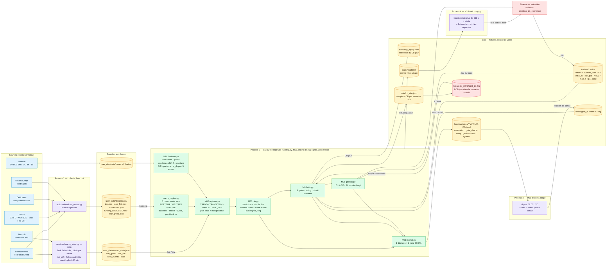

# ARCHITECTURE — ARIT 2.0 en deux images

> Vue générée depuis le code réel (`user_data/strategies/`, `services/`, `scripts/`) au 2026-07-31.
> Carte des dossiers : [`../guide.md`](../guide.md) · fiches par module : [`README.md`](README.md).
> Toutes les valeurs chiffrées viennent de `arit_lib/params.py` (chacune cite sa source PDR).

---

## 1. Structure et état — qui produit quoi, qui lit quoi

Quatre process indépendants, **zéro appel réseau dans le bot** : toute la communication passe
par des fichiers.

**Ce que le schéma impose** (interdits `docs/README.md`) : aucun LLM dans le runtime · le bot ne
touche jamais le réseau en dehors de l'exécution d'ordre, il *lit* `macro_state.json` · le watchdog
n'importe rien du projet, il ne connaît que des fichiers et ses propres clés · le journal est
append-only, un skip est journalisé aussi richement qu'une entrée.

**Angle mort mesuré** : `lookahead-analysis` ne tronque que l'OHLCV. Les fichiers macro sont
identiques dans un run complet et dans un run tronqué — un look-ahead macro ne serait donc **pas**
détecté par l'outil ; seul le `shift(1)` de `daily_regimes` le garantit.

---

## 2. Le processus exact d'une prise de trade

De la clôture d'une bougie 1 h au trade ouvert et journalisé. Toute sortie du flux est
**journalisée avec sa raison**, jamais silencieuse.

```mermaid
flowchart TD
  START(["Clôture d'une bougie 1h<br/>process_only_new_candles = True"]) --> IND

  subgraph EVAL["1 — Évaluation, populate_indicators"]
    direction TB
    IND["Informatives 4h et 1d<br/>add_indicators · find_pivots N=2 confirmés shift 2<br/>track_structure · sr_levels · candle_patterns"]
    ONEH["compute_all sur le 1h mergé<br/>atr_1h · last_hl_1h · choch_bear_event_1h<br/>new_4h · rr_dispo · s_structure momentum sr patterns volume"]
    MACRO{"Mode d'exécution"}
    MLIVE["live et dry<br/>lecture de macro_state.json<br/>fear_greed · risk_off · stale"]
    MBT["backtest<br/>macro_regime.daily_regimes<br/>décalé +1 jour"]
    REG["regimes.classify<br/>ADX_4h sous 20 = RANGE<br/>ADX_4h sous 25 = TRANSITION<br/>ADX 25+ et ema50 sur ema200 et close sur ema50 = TREND<br/>F/G sous 25 ou macro HOSTILE = RISK_OFF"]
    SEUIL["seuil : TREND 0,50 · TRANSITION 0,65<br/>+0,05 si macro NEUTRE<br/>multiplicateur : 1,0 ou 0,85 ou 0,0"]
    CONV["cio.conviction — poids FIGÉS<br/>structure 0,40 · momentum 0,20 · sr 0,15<br/>patterns 0,15 · volume 0,10"]
    IND --> ONEH --> MACRO
    MACRO -->|"live"| MLIVE
    MACRO -->|"backtest"| MBT
    MLIVE --> REG
    MBT --> REG
    REG --> SEUIL --> CONV
  end

  CONV --> SIG{"signal_long ?<br/>conviction au moins égale au seuil<br/>ET rr_dispo au moins 1,5<br/>ET régime TREND ou TRANSITION<br/>ET new_4h"}
  SIG -->|"non"| NOSIG["journal evaluation<br/>decision = no_signal"]
  SIG -->|"oui"| ENTER["populate_entry_trend<br/>enter_long = signal_long ET new_4h<br/>une seule évaluation par setup 4h"]

  ENTER --> CB{"Circuit breakers<br/>confirm_trade_entry"}
  CB -->|"2 pertes consécutives sous -0,8R<br/>cooldown 12 bougies 1h"| STOP1["journal system<br/>circuit_breaker"]
  CB -->|"équité -6 pourcent vs 00:00 UTC<br/>ou MANUAL_RESTART_FLAG"| STOP1
  CB -->|"aucun actif"| GATES

  subgraph GATES["2 — Les 8 gates dans l'ordre, arrêt au premier échec — risk.gate_check"]
    direction TB
    G1["1 · regime — TREND ou TRANSITION"]
    G2["2 · news_window — aucun event high +/-30 min<br/>macro_state absent ou périmé plus de 2h = ÉCHEC, fail-safe"]
    G3["3 · spread — au plus 0,05 pourcent"]
    G4["4 · slots — moins de 3 positions ouvertes"]
    G5["5 · residual_risk — résiduels + nouveau au plus 6 pourcent"]
    G6["6 · weekly_budget — au plus 8 pourcent par semaine ISO ET moins de 10 entrées"]
    G7["7 · rr_min — RR au moins 1,5"]
    G8["8 · veto_canari — fichier .intent posé, fenêtre 5 min<br/>désactivé en dry-run"]
    G1 --> G2 --> G3 --> G4 --> G5 --> G6 --> G7 --> G8
  end

  GATES -->|"un échec"| SKIP["journal gate_check<br/>decision = skip + gate fautif<br/>toutes les métriques sont mesurées AVANT<br/>un skip est aussi riche qu'une entrée"]
  GATES -->|"les 8 passent"| LEVELS

  subgraph SIZE["3 — Niveaux et sizing, custom_stake_amount"]
    direction TB
    LEVELS["gestion.initial_levels<br/>SL = last_hl_4h moins 0,1 x ATR_4h<br/>fallback : entrée moins 1,5 x ATR_4h<br/>TP1 = entrée +1,5R · TP2 = nearest_res_4h si au dessus de TP1"]
    RISKPCT["risk.compute_risk_pct<br/>n = conviction moins seuil sur 1 moins seuil, borné 0 à 1<br/>risque = 1 pourcent + n x cap moins 1 pourcent, divisé par le diviseur CB<br/>cap 2 pourcent trades 1 à 100 puis 3 pourcent"]
    STAKE["risk.compute_stake<br/>stake = équité x risque sur distance au SL en fraction<br/>équité courante donc compounding"]
    LEVELS --> RISKPCT --> STAKE
  end

  LEVELS -->|"SL non calculable"| SKIP2["journal skip<br/>skip_zero_stop_distance"]
  STAKE -->|"stake sous le minimum notional<br/>et le forcer dépasserait le cap"| SKIP3["journal skip<br/>skip_min_notional"]
  STAKE -->|"stake valide"| ORDER["Ordre freqtrade puis Binance"]

  ORDER --> FILL["order_filled — écrit TradeState en custom_data<br/>initial_sl immuable, unité R · risk_pct · trade_no<br/>entry_conviction · entry_regime · signal_id · tp2"]
  FILL --> LOG["journal entry<br/>prix · quantité · stake · TP1 · TP2 · signal_id"]
  LOG --> OPEN(["TRADE OUVERT — SL initial posé en plancher<br/>puis gestion G1 à G7 à chaque clôture 1h"])

  classDef ok fill:#dcfce7,stroke:#16a34a,color:#0f2e18
  classDef gate fill:#e0f2fe,stroke:#0284c7,color:#0c2b3d
  classDef out fill:#fee2e2,stroke:#dc2626,color:#450a0a
  classDef term fill:#ede9fe,stroke:#7c3aed,color:#2b1a52

  class IND,ONEH,MLIVE,MBT,REG,SEUIL,CONV,ENTER,LEVELS,RISKPCT,STAKE,ORDER,FILL,LOG ok
  class G1,G2,G3,G4,G5,G6,G7,G8 gate
  class NOSIG,STOP1,SKIP,SKIP2,SKIP3 out
  class START,OPEN,SIG,CB,MACRO term
```

### Après l'entrée (hors périmètre du 2ᵉ schéma)

À **chaque clôture 1 h**, dans cet ordre (`docs/modules/M05 §2`) : `update_excursions` (MAE/MFE en R,
une action par bougie) → `check_exit` (**G6 > G7 > TP2**) → `partial_tp` (**G4**) → **G5** →
`compute_sl` = `max(G1, G2, G3)` — et **jamais un SL plus large** (invariant re-vérifié dans le code).

| Règle | Déclencheur | Effet |
|---|---|---|
| G1 | MFE ≥ +1,0R | SL → entrée × 1,001 (break-even + frais) |
| G2 | toujours | SL → last_hl_1h − 0,1 × ATR_1h, seulement si ça resserre |
| G3 | MFE ≥ +1,0R | SL → close − 2,0 × ATR_1h (1,5 × en RISK_OFF) |
| G4 | premier +1,5R | vend 50 % de la quantité, une seule fois |
| G5 | BOS 4h frais après TP1 | neutralise TP2 (on laisse courir) |
| G6 | CHoCH baissier 1h (événement, pendant la vie du trade) | sortie totale |
| G7 | 24 bougies 1h et MFE < +0,5R | sortie totale (trade mort) |

### Preuve mécanique associée

`scripts/check_bias.py` audite ces deux schémas : `lookahead-analysis` vérifie que la chaîne de
décision du 2ᵉ schéma ne consomme aucune donnée future, `recursive-analysis` vérifie le warm-up des
indicateurs du 1ᵉʳ. Relevés et verdicts : [`../scripts/README.md`](../scripts/README.md).
